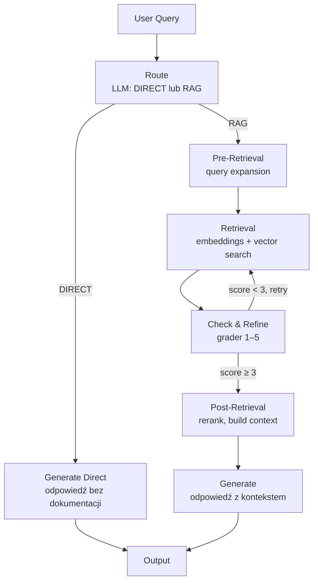
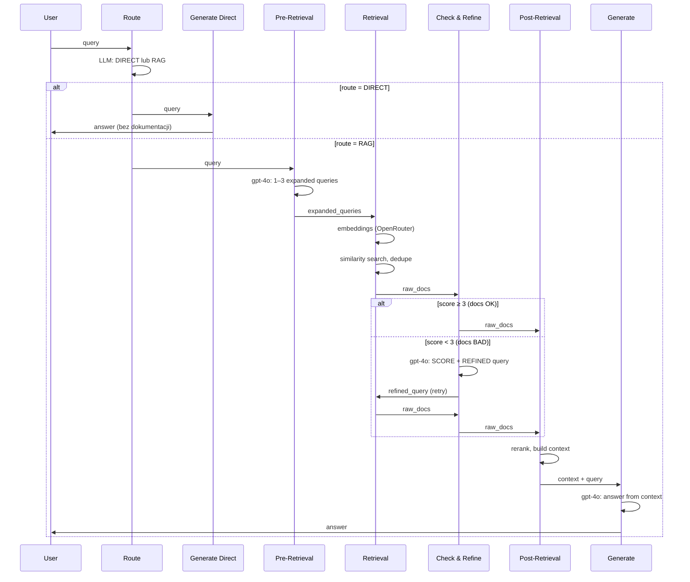

# Advanced RAG – Dokumentacja architektury

Pipeline RAG (Retrieval Augmented Generation) dla dokumentacji Docker. Zbudowany w LangGraph z etapami: **route** (direct vs RAG), pre-retrieval, retrieval, grader + refinement, post-retrieval, generate.

→ Instalacja i uruchomienie: [README](../README.md)

---

## Przepływ – diagram główny

```
  User Query
       │
       ▼
┌─────────────────┐
│     Route       │  LLM: DIRECT (ogólne) lub RAG (konkretna dokumentacja)
│  (gpt-4o)       │
└────────┬────────┘
         │
    ┌────┴────┐
    │         │
    ▼         ▼
 DIRECT     RAG
    │         │
    │         ▼
    │    ┌─────────────────┐     ┌─────────────┐     ┌─────────────────────┐
    │    │  Pre-Retrieval  │────►│  Retrieval  │────►│  Check & Refine     │
    │    │  query expansion│     │  embeddings │     │  (grader 1–5)       │
    │    └─────────────────┘     └─────────────┘     └──────────┬──────────┘
    │                                                           │
    │              ┌──────────────────────────────┼──────────────────────────────┐
    │              │                              │                              │
    │              ▼                              │                              ▼
    │       score ≥ 3 (OK)                        │                        score < 3 (BAD)
    │              │                              │                              │ retry (max 1×)
    │              ▼                              ◄──────────────────────────────┘
    │       ┌─────────────────┐     ┌─────────────┐
    │       │ Post-Retrieval  │────►│  Generate   │
    │       │ rerank, context │     │  (context)  │
    │       └─────────────────┘     └──────┬──────┘
    │                                      │
    └──────────────────────────────────────┼──────────────────────────────────►  Output
                                           │
                                    (direct: LLM bez kontekstu)
```

---

## Diagram Mermaid – flowchart



---

## Diagram Mermaid – sekwencja (z retry)



---

## Opis etapów

| Etap | Model | Opis |
|------|-------|------|
| **Route** | SMART_LLM | LLM decyduje: **DIRECT** (pytanie ogólne, np. „Co to jest Docker?”) – odpowiedź bez dokumentacji, lub **RAG** (konkretne instrukcje, komendy, konfiguracja) – uruchomienie pipeline RAG. |
| **Pre-Retrieval** | openai/gpt-4o | Zamiana pytania na 1–3 zapytania wyszukiwania (routing, rewriting, expansion). |
| **Retrieval** | openai/text-embedding-3-small | **Orchestrator–workers**: równoległe workery (ThreadPoolExecutor) – każdy worker wykonuje embedding + wyszukiwanie dla jednego expanded query. Przyspiesza retrieval. Konfiguracja: `RETRIEVAL_MAX_WORKERS` w `config.py`. |
| **Check & Refine** | openai/gpt-5.2 | **Grader 0.00–1.00**: ocena relewancji chunków (2 miejsca po przecinku). Score ≥ 0.50 → OK. Score < 0.50 → LLM poprawia pytanie i retry retrieval (max 1×). |
| **Post-Retrieval** | — | Rerank, deduplikacja, budowanie kontekstu (do 6 chunków). |
| **Generate** | openai/gpt-4o | Odpowiedź na podstawie kontekstu (RAG) lub odpowiedź z wiedzy ogólnej (direct). Przy braku dopasowania: komunikat + propozycja najbliższej informacji. |

---

## Route (direct vs RAG)

Na początku pipeline LLM ocenia, czy pytanie wymaga dokumentacji:

- **DIRECT** – pytania ogólne, wprowadzające, o podstawowe koncepty (np. „Co to jest kontener?”, „What is Docker?”). Odpowiedź z wiedzy ogólnej bez wyszukiwania w dokumentacji.
- **RAG** – pytania o konkretne instrukcje, komendy, konfigurację, API, przewodniki krok po kroku. Uruchamiany jest pełny pipeline RAG (pre-retrieval → retrieval → … → generate).

LLM: OpenAI (gpt-4o, gpt-5.2 dla gradera). Embeddingi: OpenAI (Qwen3-embedding przez OpenRouter powodował błąd). Można zmieniać modele w `config.py`.

**Uwaga:** Zmiana modelu embedding wymaga przebudowy indeksu: `REBUILD_INDEX=1 python build_index.py`.

---

## Grader (Check & Refine)

Decyzja o jakości dokumentów:

1. **Wejście**: `query`, pierwsze 3 chunki (tytuł + 80 znaków treści).
2. **LLM zwraca**:
   - `SCORE: 0.00–1.00` (0.00 = zupełnie nieistotne, 1.00 = idealnie istotne, 2 miejsca po przecinku),
   - `REFINED:` – poprawione pytanie (gdy score < 0.50) lub oryginał (gdy ≥ 0.50).
3. **Próg** `RELEVANCE_THRESHOLD = 0.5`:
   - score ≥ 0.50 → dalej do post_retrieval,
   - score < 0.50 → retry retrieval z refined query (max 1 retry).

---

## Zachowanie przy braku dopasowania

Gdy pytanie **nie występuje** w dokumentacji:

1. Generate **jasno informuje**, że dokładnej informacji nie ma.
2. **Proponuje najbliższą** pasującą treść z kontekstu.

---

## Pliki projektu

| Plik | Odpowiedzialność |
|------|------------------|
| `config.py` | Stałe: CHROMA_DIR, COLLECTION_NAME, OPENROUTER_*, modele, RETRIEVAL_MAX_WORKERS (liczba równoległych retrieval workers). |
| `build_index.py` | Budowanie indeksu Chroma (uruchamiane ręcznie). |
| `retriever.py` | Retriever i tool `create_docker_docs_tool()`. |
| `workflow.py` | LangGraph workflow: route_query → (generate_direct | pre_retrieval → retrieval → check_and_refine → post_retrieval → generate). |
| `tests/` | Testy: jednostkowe (workflow, build_index), integracyjne (retriever, ask). `SKIP_INTEGRATION=1` pomija testy wymagające API. |

---

## Uruchomienie

Po instalacji zależności i utworzeniu pliku `.env` z `OPENAI_API_KEY` (zobacz [README](../README.md)):

```bash
# Aktywacja środowiska
source venv/bin/activate

# Budowanie indeksu (jednorazowo; dane z Kaggle lub ./data/)
python build_index.py

# Zapytanie przez API Pythona
python -c "from workflow import ask; print(ask('Jak zainstalować Docker?'))"

# Uruchomienie z przykładowym pytaniem
python workflow.py

# Testy – wszystkie (wymaga indeksu Chroma i API OpenRouter)
python -m unittest discover tests -v

# Tylko testy jednostkowe (bez API/Chroma)
SKIP_INTEGRATION=1 python -m unittest discover tests -v
```

---

## OpenRouter

LLM i embeddingi korzystają z **OpenRouter** – możesz wybierać różne modele (OpenAI, Anthropic, Google itd.). W `.env`:

```
OPENROUTER_API_KEY=sk-or-v1-...
OPENROUTER_BASE_URL=https://openrouter.ai/api/v1
```

W `config.py` ustaw `EMBEDDING_MODEL`, `SMART_LLM_MODEL` i `GRADER_LLM_MODEL` w formacie `provider/model` (np. `anthropic/claude-3.5-sonnet`, `google/gemini-pro`).

---

## Observability (LangSmith)

Projekt korzysta z **LangSmith** do śledzenia wywołań LLM i workflow. Skonfiguruj `.env`:

```
LANGSMITH_TRACING=true
LANGSMITH_API_KEY=lsv2_pt_...
LANGSMITH_ENDPOINT=https://eu.api.smith.langchain.com   # opcjonalnie dla EU
LANGSMITH_PROJECT=hybrid-rag
```

Przy włączonym tracingu tracy są wysyłane do [smith.langchain.com](https://smith.langchain.com).

---

## Debug

Workflow wypisuje `[DEBUG ...]` dla route_query, pre_retrieval, retrieval, check_and_refine, post_retrieval (wejście/wyjście, route, score, expanded_queries).
