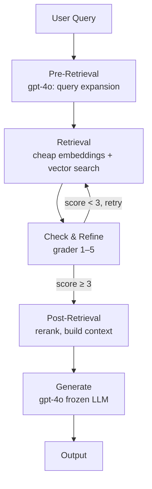
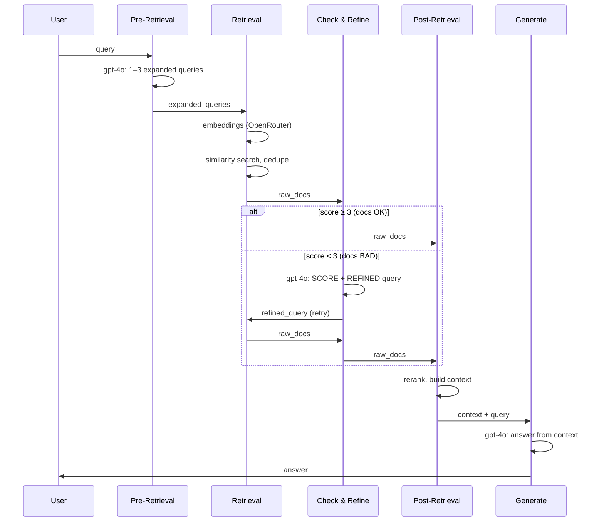

# Advanced RAG – Dokumentacja architektury

Pipeline RAG (Retrieval Augmented Generation) dla dokumentacji Docker. Zbudowany w LangGraph z etapami: pre-retrieval, retrieval, grader + refinement, post-retrieval, generate.

→ Instalacja i uruchomienie: [README](../README.md)

---

## Przepływ – diagram główny

```
  User Query
       │
       ▼
┌─────────────────┐     ┌─────────────┐     ┌─────────────────────┐
│  Pre-Retrieval  │────►│  Retrieval  │────►│  Check & Refine     │
│  (gpt-4o)       │     │  (cheap     │     │  (grader 1–5)       │
│  query expansion│     │  embeddings)│     │                     │
└─────────────────┘     └─────────────┘     └──────────┬──────────┘
                                                       │
                        ┌──────────────────────────────┼──────────────────────────────┐
                        │                              │                              │
                        ▼                              │                              ▼
                 score ≥ 3 (OK)                        │                        score < 3 (BAD)
                        │                              │                              │
                        │                              │                              │ LLM: refined query
                        │                              │                              │ (intencja, kontekst,
                        │                              │                              │  wieloznaczność)
                        │                              ◄──────────────────────────────┘
                        │                                    retry (max 1×)
                        │
                        ▼
┌─────────────────┐     ┌─────────────┐
│ Post-Retrieval  │────►│  Generate   │────►  Output
│ rerank, context │     │  (gpt-4o)   │
└─────────────────┘     └─────────────┘
```

---

## Diagram Mermaid – flowchart



---

## Diagram Mermaid – sekwencja (z retry)



---

## Opis etapów

| Etap | Model | Opis |
|------|-------|------|
| **Pre-Retrieval** | deepseek/deepseek-chat | Zamiana pytania na 1–3 zapytania wyszukiwania (routing, rewriting, expansion). |
| **Retrieval** | openai/text-embedding-3-small | Embeddingi + wyszukiwanie wektorowe w Chroma (przez OpenRouter). |
| **Check & Refine** | deepseek/deepseek-chat | **Grader 1–5**: ocena relewancji chunków. Score ≥ 3 → OK. Score < 3 → LLM poprawia pytanie (intencja, kontekst, wieloznaczność) i retry retrieval (max 1×). |
| **Post-Retrieval** | — | Rerank, deduplikacja, budowanie kontekstu (do 6 chunków). |
| **Generate** | deepseek/deepseek-chat | Odpowiedź na podstawie kontekstu. Przy braku dopasowania: komunikat + propozycja najbliższej informacji. |

LLM: DeepSeek. Embeddingi: OpenAI (Qwen3-embedding przez OpenRouter powodował błąd). Można zmieniać modele w `config.py`.

**Uwaga:** Zmiana modelu embedding wymaga przebudowy indeksu: `REBUILD_INDEX=1 python build_index.py`.

---

## Grader (Check & Refine)

Decyzja o jakości dokumentów:

1. **Wejście**: `query`, pierwsze 3 chunki (tytuł + 80 znaków treści).
2. **LLM zwraca**:
   - `SCORE: 1–5` (1 = zupełnie nieistotne, 5 = idealnie istotne),
   - `REFINED:` – poprawione pytanie (gdy score < 3) lub oryginał (gdy ≥ 3).
3. **Próg** `RELEVANCE_THRESHOLD = 3`:
   - score ≥ 3 → dalej do post_retrieval,
   - score < 3 → retry retrieval z refined query (max 1 retry).

---

## Zachowanie przy braku dopasowania

Gdy pytanie **nie występuje** w dokumentacji:

1. Generate **jasno informuje**, że dokładnej informacji nie ma.
2. **Proponuje najbliższą** pasującą treść z kontekstu.

---

## Pliki projektu

| Plik | Odpowiedzialność |
|------|------------------|
| `config.py` | Stałe: CHROMA_DIR, COLLECTION_NAME, OPENROUTER_*, modele (EMBEDDING_MODEL, SMART_LLM_MODEL). |
| `build_index.py` | Budowanie indeksu Chroma (uruchamiane ręcznie). |
| `retriever.py` | Retriever i tool `create_docker_docs_tool()`. |
| `workflow.py` | LangGraph workflow: pre_retrieval → retrieval → check_and_refine → post_retrieval → generate. |
| `tests/` | Testy: jednostkowe (workflow, build_index), integracyjne (retriever, ask). `SKIP_INTEGRATION=1` pomija testy wymagające API. |

---

## Uruchomienie

Po instalacji zależności i utworzeniu pliku `.env` z `OPENAI_API_KEY` (zobacz [README](../README.md)):

```bash
# Aktywacja środowiska
source venv/bin/activate

# Budowanie indeksu (jednorazowo; dane z Kaggle lub ./data/)
python build_index.py

# Zapytanie przez API Pythona
python -c "from workflow import ask; print(ask('Jak zainstalować Docker?'))"

# Uruchomienie z przykładowym pytaniem
python workflow.py

# Testy – wszystkie (wymaga indeksu Chroma i API OpenRouter)
python -m unittest discover tests -v

# Tylko testy jednostkowe (bez API/Chroma)
SKIP_INTEGRATION=1 python -m unittest discover tests -v
```

---

## OpenRouter

LLM i embeddingi korzystają z **OpenRouter** – możesz wybierać różne modele (OpenAI, Anthropic, Google itd.). W `.env`:

```
OPENROUTER_API_KEY=sk-or-v1-...
OPENROUTER_BASE_URL=https://openrouter.ai/api/v1
```

W `config.py` ustaw `EMBEDDING_MODEL` i `SMART_LLM_MODEL` w formacie `provider/model` (np. `anthropic/claude-3.5-sonnet`, `google/gemini-pro`).

---

## Observability (LangSmith)

Projekt korzysta z **LangSmith** do śledzenia wywołań LLM i workflow. Skonfiguruj `.env`:

```
LANGSMITH_TRACING=true
LANGSMITH_API_KEY=lsv2_pt_...
LANGSMITH_ENDPOINT=https://eu.api.smith.langchain.com   # opcjonalnie dla EU
LANGSMITH_PROJECT=hybrid-rag
```

Przy włączonym tracingu tracy są wysyłane do [smith.langchain.com](https://smith.langchain.com).

---

## Debug

Workflow wypisuje `[DEBUG ...]` dla pre_retrieval, retrieval, check_and_refine, post_retrieval (wejście/wyjście, score, expanded_queries).
