# Advanced RAG – Dokumentacja architektury

Pipeline RAG (Retrieval Augmented Generation) dla dokumentacji Docker. Zbudowany w LangGraph z etapami: **ingest** (multi-turn), pre-retrieval, retrieval, grader + refinement, post-retrieval, **summarize_conversation**, generate.

→ Instalacja i uruchomienie: [README](../README.md)

---

## Przepływ – diagram główny (branch token-savings-conversation-hygiene)

```
  messages (HumanMessage)
       │
       ▼
┌─────────────────┐
│     Ingest      │  query = messages[-1].content
└────────┬────────┘
         │
         ▼
┌─────────────────┐     ┌─────────────┐     ┌─────────────────────┐
│  Pre-Retrieval  │────►│  Retrieval  │────►│  Check & Refine     │
│  query expansion│     │  embeddings │     │  (grader 0–1)       │
└─────────────────┘     └─────────────┘     └──────────┬──────────┘
                                                       │
                        ┌──────────────────────────────┼──────────────────────────────┐
                        │                              │                              │
                        ▼                              │                              ▼
                 score ≥ 0.50 (OK)                     │                        score < 0.50 (BAD)
                        │                              │                              │ retry (max 1×)
                        ▼                              ◄──────────────────────────────┘
                 ┌─────────────────┐     ┌──────────────────────┐     ┌─────────────┐
                 │ Post-Retrieval  │────►│ Summarize conversation│────►│  Generate   │
                 │ rerank, context │     │ (gdy messages > 1500  │     │ (context +  │
                 └─────────────────┘     │  tokenów)             │     │  summary)   │
                                        └──────────────────────┘     └──────┬──────┘
                                                                             │
                                                                             ▼
                                                                          Output
```

---

## Diagram Mermaid – flowchart

```mermaid
flowchart TB
    M[messages]
    INGEST[Ingest<br/>query z messages[-1]]
    PR[Pre-Retrieval<br/>query expansion]
    R[Retrieval<br/>embeddings + vector search]
    CR[Check & Refine<br/>grader 0–1]
    POST[Post-Retrieval<br/>rerank, build context]
    SUM[Summarize conversation<br/>gdy messages > 1500 tokenów]
    GEN[Generate<br/>context + summary + messages]
    OUT[Output]

    M --> INGEST
    INGEST --> PR
    PR --> R
    R --> CR
    CR -->|score ≥ 0.5| POST
    CR -->|score < 0.5, retry| R
    POST --> SUM
    SUM --> GEN
    GEN --> OUT
```

---

## Diagram workflow – kolorowy UML (Mermaid)

Diagram aktywności w stylu UML: kolorowe węzły, różne kształty, wyraźne decyzje.

```mermaid
flowchart TB
    subgraph input [" 📥 Wejście "]
        M(("messages<br/>HumanMessage"))
    end

    subgraph processing [" ⚙️ Pipeline RAG "]
        INGEST[Ingest<br/>query = messages[-1]]
        PR[Pre-Retrieval<br/>1–3 expanded queries]
        R[Retrieval<br/>embedding + vector search]
        POST[Post-Retrieval<br/>rerank, 6 chunków]
        SUM[Summarize conversation<br/>messages > 1500 tok.]
        GEN[Generate<br/>context + summary + msgs]
    end

    subgraph decision [" ❓ Decyzja "]
        CR{{"Grader<br/>score 0–1"}}
    end

    subgraph output [" 📤 Wyjście "]
        OUT(("answer"))
    end

    M --> INGEST
    INGEST --> PR
    PR --> R
    R --> CR
    CR -->|"≥ 0.5 OK"| POST
    CR -->|"< 0.5 retry (max 1×)"| R
    POST --> SUM
    SUM --> GEN
    GEN --> OUT

    classDef inputStyle fill:#e3f2fd,stroke:#1565c0,stroke-width:2px
    classDef processStyle fill:#fff8e1,stroke:#f9a825,stroke-width:2px
    classDef decisionStyle fill:#fce4ec,stroke:#c2185b,stroke-width:2px
    classDef outputStyle fill:#e8f5e9,stroke:#2e7d32,stroke-width:2px

    class M,OUT inputStyle,outputStyle
    class INGEST,PR,R,POST,SUM,GEN processStyle
    class CR decisionStyle
```

---

## Diagram Mermaid – sekwencja (z retry)

```mermaid
sequenceDiagram
    participant U as User
    participant INGEST as Ingest
    participant PR as Pre-Retrieval
    participant R as Retrieval
    participant CR as Check & Refine
    participant POST as Post-Retrieval
    participant SUM as Summarize
    participant GEN as Generate

    U->>INGEST: messages
    INGEST->>INGEST: query = messages[-1].content
    INGEST->>PR: query
    PR->>PR: gpt-4o: 1–3 expanded queries
    PR->>R: expanded_queries

    R->>R: embeddings (OpenRouter)
    R->>R: similarity search, dedupe
    R->>CR: raw_docs

    alt score ≥ 0.5 (docs OK)
        CR->>POST: raw_docs
    else score < 0.5 (docs BAD)
        CR->>CR: gpt-4o: SCORE + REFINED query
        CR->>R: refined_query (retry)
        R->>CR: raw_docs
        CR->>POST: raw_docs
    end

    POST->>POST: rerank, build context
    POST->>SUM: context, messages
    alt messages > 1500 tokenów
        SUM->>SUM: LLM: summarize starsze wiadomości, RemoveMessage
    end
    SUM->>GEN: context + summary + messages
    GEN->>GEN: trim_messages(max 4096), gpt-4o: answer
    GEN->>U: answer
```



---

## Opis etapów

| Etap | Model | Opis |
|------|-------|------|
| **Ingest** | — | Pobiera `query` z ostatniej wiadomości użytkownika (`messages[-1].content`). Wejście: `messages` (add_messages). |
| **Pre-Retrieval** | SMART_LLM | Zamiana pytania na 1–3 zapytania wyszukiwania (routing, rewriting, expansion). |
| **Retrieval** | EMBEDDING_MODEL | **Orchestrator–workers**: równoległe workery (ThreadPoolExecutor) – każdy worker wykonuje embedding + wyszukiwanie dla jednego expanded query. Konfiguracja: `RETRIEVAL_MAX_WORKERS` w `config.py`. |
| **Check & Refine** | GRADER_LLM | **Grader 0.00–1.00**: ocena relewancji chunków. Score ≥ 0.50 → OK. Score < 0.50 → LLM poprawia pytanie i retry retrieval (max 1×). |
| **Post-Retrieval** | — | Rerank, deduplikacja, budowanie kontekstu (do 6 chunków). |
| **Summarize conversation** | SMART_LLM | Gdy `messages` > 1500 tokenów, LLM podsumowuje starsze wiadomości; RemoveMessage usuwa je, zostają 2 ostatnie. Pattern: [Summarize messages](https://docs.langchain.com/oss/python/langgraph/add-memory#summarize-messages). |
| **Generate** | SMART_LLM | Odpowiedź z kontekstu RAG + `summary` (jeśli jest) + `messages`. `trim_messages` ogranicza do 4096 tokenów. Przy braku dopasowania: komunikat + propozycja najbliższej informacji. |

---

## Multi-turn i pamięć rozmowy

- **messages** – historia rozmowy (HumanMessage, AIMessage) dzięki `add_messages` (LangGraph).
- **thread_id** – każda sesja ma osobny wątek; `ask(query, thread_id="user-123")` zachowuje historię między wywołaniami.
- **Summarize conversation** – gdy `messages` przekracza `MAX_MESSAGES_BEFORE_SUMMARY` (1500 tokenów), LLM podsumowuje starsze wiadomości; generate dostaje `summary` + ostatnie 2 messages.
- **Decyzja o summarization** – na podstawie długości `messages` (historia akumuluje się), nie `context` (RAG jest przebudowywany przy każdym pytaniu i ma stały limit).

Stałe w `workflow.py`: `MAX_MESSAGES_BEFORE_SUMMARY`, `MAX_CONTENT_TOKENS`.

LLM i embeddingi: `config.py` (SMART_LLM_MODEL, GRADER_LLM_MODEL, EMBEDDING_MODEL). **Uwaga:** Zmiana modelu embedding wymaga przebudowy indeksu: `REBUILD_INDEX=1 python build_index.py`.

---

## Grader (Check & Refine)

Decyzja o jakości dokumentów:

1. **Wejście**: `query`, pierwsze 3 chunki (tytuł + 80 znaków treści).
2. **LLM zwraca**:
   - `SCORE: 0.00–1.00` (0.00 = zupełnie nieistotne, 1.00 = idealnie istotne, 2 miejsca po przecinku),
   - `REFINED:` – poprawione pytanie (gdy score < 0.50) lub oryginał (gdy ≥ 0.50).
3. **Próg** `RELEVANCE_THRESHOLD = 0.5`:
   - score ≥ 0.50 → dalej do post_retrieval,
   - score < 0.50 → retry retrieval z refined query (max 1 retry).

---

## Zachowanie przy braku dopasowania

Gdy pytanie **nie występuje** w dokumentacji:

1. Generate **jasno informuje**, że dokładnej informacji nie ma.
2. **Proponuje najbliższą** pasującą treść z kontekstu.

---

## Pliki projektu

| Plik | Odpowiedzialność |
|------|------------------|
| `config.py` | Stałe: CHROMA_DIR, COLLECTION_NAME, OPENROUTER_*, modele, RETRIEVAL_MAX_WORKERS (liczba równoległych retrieval workers). |
| `build_index.py` | Budowanie indeksu Chroma (uruchamiane ręcznie). |
| `retriever.py` | Retriever i tool `create_docker_docs_tool()`. |
| `workflow.py` | LangGraph workflow: ingest → pre_retrieval → retrieval → check_and_refine → post_retrieval → summarize_conversation → generate. Stałe: MAX_MESSAGES_BEFORE_SUMMARY, MAX_CONTENT_TOKENS. |
| `eval_dataset.py` | Tworzenie datasetu LangSmith (branch langsmith-eval). |
| `eval_rag.py` | Ewaluacja RAG przez LangSmith Client (branch langsmith-eval). |
| `tests/` | Testy: jednostkowe (workflow ingest, summarize_conversation, generate, post_retrieval, retrieval, grader; build_index, eval), integracyjne (retriever, ask). `SKIP_INTEGRATION=1` pomija testy wymagające API. |

---

## Uruchomienie

Po instalacji zależności i utworzeniu pliku `.env` z `OPENAI_API_KEY` (zobacz [README](../README.md)):

```bash
# Aktywacja środowiska
source venv/bin/activate

# Budowanie indeksu (jednorazowo; dane z Kaggle lub ./data/)
python build_index.py

# Zapytanie przez API Pythona
python -c "from workflow import ask; print(ask('Jak zainstalować Docker?'))"

# Uruchomienie z przykładowym pytaniem
python workflow.py

# Testy – wszystkie (wymaga indeksu Chroma i API OpenRouter)
python -m unittest discover tests -v

# Tylko testy jednostkowe (bez API/Chroma)
SKIP_INTEGRATION=1 python -m unittest discover tests -v
```

---

## OpenRouter

LLM i embeddingi korzystają z **OpenRouter** – możesz wybierać różne modele (OpenAI, Anthropic, Google itd.). W `.env`:

```
OPENROUTER_API_KEY=sk-or-v1-...
OPENROUTER_BASE_URL=https://openrouter.ai/api/v1
```

W `config.py` ustaw `EMBEDDING_MODEL`, `SMART_LLM_MODEL` i `GRADER_LLM_MODEL` w formacie `provider/model` (np. `anthropic/claude-3.5-sonnet`, `google/gemini-pro`).

---

## Observability (LangSmith)

Projekt korzysta z **LangSmith** do śledzenia wywołań LLM i workflow. Skonfiguruj `.env`:

```
LANGSMITH_TRACING=true
LANGSMITH_API_KEY=lsv2_pt_...
LANGSMITH_ENDPOINT=https://eu.api.smith.langchain.com   # opcjonalnie dla EU
LANGSMITH_PROJECT=hybrid-rag
```

Przy włączonym tracingu tracy są wysyłane do [smith.langchain.com](https://smith.langchain.com).

---

## Ewaluacja (branch langsmith-eval)

Skrypty `eval_dataset.py` i `eval_rag.py` umożliwiają ewaluację RAG na datasetcie LangSmith:

- **eval_dataset.py** – tworzy dataset "Docker RAG Eval" z 8 pytaniami, expected_keywords i expected_answer.
- **eval_rag.py** – uruchamia workflow na datasetcie, evaluatory:
  - `answer_not_empty` – heurystyka (0 tokenów)
  - `expected_keywords_present` – heurystyka (0 tokenów)
  - `qa_correctness` – LLM-as-judge, opcja `--llm-judge` (dodatkowe wywołania LLM)

Wyniki eksportowane do LangSmith; można porównać eksperymenty i pobrać CSV.

---

## Trace mode (opcja uruchomieniowa)

Z flagą `--trace` workflow generuje dwa dokumenty markdown:

1. **answer.md** – ładna odpowiedź w formacie MD.
2. **flow_trace.md** – opis krok po kroku przepływu:
   - każdy węzeł (ingest, pre_retrieval, retrieval, check_and_refine, post_retrieval, summarize_conversation, generate),
   - użyty model (np. openai/gpt-4o, openai/text-embedding-3-small),
   - liczba wywołań API,
   - szczegóły (np. "Skipped (no docs)" lub "Skipped (retry limit reached, passing to post_retrieval)" dla check_and_refine),
   - podsumowanie wywołań per model.

```bash
python workflow.py --trace -q "Jak zainstalować Docker?" -o ./output
```

Programowo: `ask(query, trace=True)` zwraca `(answer_md, flow_trace_md)`.

---

## Debug

Workflow wypisuje `[DEBUG ...]` dla route_query, pre_retrieval, retrieval, check_and_refine, post_retrieval (wejście/wyjście, route, score, expanded_queries).
